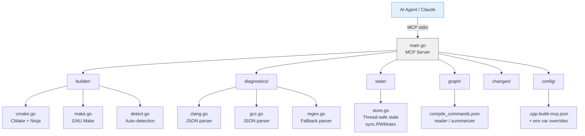
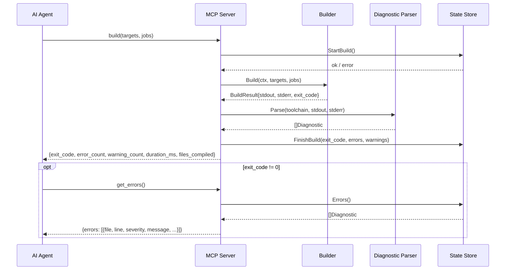
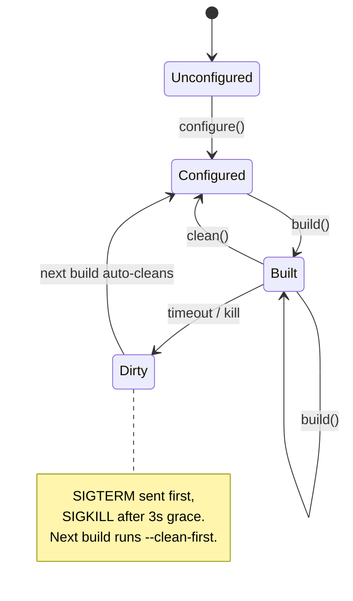
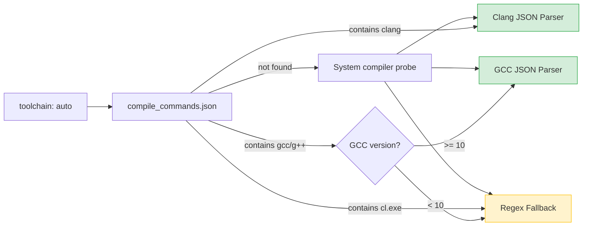

# cpp-build-mcp

An MCP server that wraps C++ build systems (CMake/Ninja/Make) and exposes structured, token-efficient tools for AI coding agents. Compiler output is pre-processed into structured diagnostics so raw build logs never enter the AI context window.

The core loop: **configure** -> **build** -> **get_errors** -> fix -> **build** — with each response under ~500 tokens.

## Architecture



### Build Flow



### State Machine



## Installation

```
go install github.com/danweinerdev/cpp-build-mcp@latest
```

Requires Go 1.22+ and a C++ build toolchain (CMake + Ninja, or GNU Make).

## Using with Claude Code

Add a `.mcp.json` file to your C++ project root:

```json
{
  "mcpServers": {
    "cpp-build": {
      "command": "cpp-build-mcp",
      "args": []
    }
  }
}
```

Then create a `.cpp-build-mcp.json` config (optional — defaults work for standard CMake projects):

```json
{
  "build_dir": "build",
  "generator": "ninja",
  "cmake_args": ["-DCMAKE_BUILD_TYPE=Debug"]
}
```

Once configured, Claude Code can use the build tools directly. A typical session looks like:

```
You: "Build the project and fix any errors"

Claude calls: configure()
  -> {success: true, error_count: 0, messages: []}

Claude calls: build()
  -> {exit_code: 1, error_count: 2, warning_count: 1, duration_ms: 1420, files_compiled: 5}

Claude calls: get_errors()
  -> {errors: [
       {file: "src/main.cpp", line: 42, column: 10, severity: "error",
        message: "no member named 'push' in 'std::vector<int>'"},
       {file: "src/util.cpp", line: 17, column: 5, severity: "error",
        message: "use of undeclared identifier 'result'"}
     ]}

Claude calls: suggest_fix(error_index: 0)
  -> {file: "src/main.cpp", start_line: 32, end_line: 52, source: "...", diagnostic: {...}}

Claude fixes the code, then:

Claude calls: build()
  -> {exit_code: 0, error_count: 0, warning_count: 0, duration_ms: 380, files_compiled: 2}
```

The two-step design (`build` then `get_errors`) is intentional — `build` returns a compact summary so successful builds (the common case) cost minimal tokens. Full diagnostics are fetched only when needed.

### Claude Desktop

Add to your `claude_desktop_config.json`:

```json
{
  "mcpServers": {
    "cpp-build": {
      "command": "cpp-build-mcp",
      "args": [],
      "cwd": "/path/to/your/cpp/project"
    }
  }
}
```

## Tools

| Tool | Parameters | Response |
|------|-----------|----------|
| `configure` | `config?: string, cmake_args?: string[]` | `{config, success, error_count, messages}` |
| `build` | `config?: string, targets?: string[], jobs?: number` | `{config, exit_code, error_count, warning_count, duration_ms, files_compiled}` |
| `get_errors` | `config?: string` | `{config, errors: [{file, line, column, severity, message, code}]}` |
| `get_warnings` | `config?: string, filter?: string` | `{config, warnings: [...], count}` |
| `suggest_fix` | `config?: string, error_index: number` | `{config, file, start_line, end_line, source, diagnostic}` |
| `clean` | `config?: string, targets?: string[]` | `{config, success, message}` |
| `get_changed_files` | `config?: string` | `{config, files, count, method}` |
| `get_build_graph` | `config?: string` | `{config, available, file_count, translation_units, include_dirs}` |
| `list_configs` | _(none)_ | `{configs: [{name, build_dir, status}], default_config}` |

All tools accept an optional `config` parameter to target a specific named configuration. When omitted, the default configuration is used. Every response includes a `config` field identifying which configuration was acted on.

**Resource:** `build://health` — one-line status string. With a single config: `OK: 0 errors, 2 warnings, last build 30s ago`. With multiple configs: pipe-separated aggregate like `debug: OK | release: FAIL(3 errors)`.

### Tool Details

**`build`** — Runs an incremental build. Parses Ninja `[N/M]` progress lines to report `files_compiled`. If the previous build was killed (dirty state), automatically cleans first. Build timeout is configurable (default 5 minutes); on timeout, sends SIGTERM with a 3-second grace period before SIGKILL.

**`get_errors`** — Returns up to 20 structured diagnostics from the last build. Each entry includes file path, line, column, severity, message, and diagnostic code. Errors are parsed from JSON (Clang/GCC 10+) or regex (MSVC/legacy).

**`suggest_fix`** — Given an error index, reads the source file and returns +/-10 lines of context around the error location. Useful for understanding the code around a diagnostic without reading the entire file.

**`get_changed_files`** — Detects files changed since the last successful build using `git diff` (preferred) or mtime comparison (fallback). The `method` field indicates which detection was used.

**`get_build_graph`** — Summarizes `compile_commands.json`: file count, translation units, include directories. Returns `available: false` for Make projects or unconfigured CMake projects.

## Configuration

`.cpp-build-mcp.json` in the project root. All fields optional:

| Field | Type | Default | Description |
|-------|------|---------|-------------|
| `build_dir` | string | `"build"` | Build output directory |
| `source_dir` | string | `"."` | Source directory |
| `toolchain` | string | `"auto"` | `"auto"`, `"clang"`, `"gcc"`, `"msvc"` |
| `generator` | string | `"ninja"` | `"ninja"` or `"make"` |
| `preset` | string | `""` | CMake preset name (empty = no preset) |
| `cmake_args` | string[] | `[]` | Extra CMake configure arguments |
| `build_timeout` | string | `"5m"` | Max build duration (Go duration format) |
| `inject_diagnostic_flags` | bool | `true` | Inject compiler diagnostic format flags via [CMAKE_PROJECT_INCLUDE](#diagnostic-format-injection) |
| `diagnostic_serial_build` | bool | `false` | Force `-j1` for cleaner diagnostic output |
| `configs` | object | _(none)_ | Map of named configurations (see [Multiple Build Configurations](#multiple-build-configurations)) |
| `default_config` | string | _(first alphabetically)_ | Default configuration name when `configs` is present |

### Environment variable overrides

These take precedence over the config file:

- `CPP_BUILD_MCP_BUILD_DIR`
- `CPP_BUILD_MCP_SOURCE_DIR`
- `CPP_BUILD_MCP_TOOLCHAIN`
- `CPP_BUILD_MCP_GENERATOR`
- `CPP_BUILD_MCP_BUILD_TIMEOUT`

## Multiple Build Configurations

The server supports managing multiple named build configurations simultaneously. Each configuration has its own build directory, state machine, and diagnostics -- they are fully isolated from each other.

### Config file with multiple configurations

Use the `configs` map in `.cpp-build-mcp.json` to define named configurations. Top-level fields serve as defaults that each config inherits and can override:

```json
{
  "source_dir": ".",
  "toolchain": "auto",
  "generator": "ninja",
  "configs": {
    "debug": {
      "build_dir": "build/debug",
      "cmake_args": ["-DCMAKE_BUILD_TYPE=Debug"]
    },
    "release": {
      "build_dir": "build/release",
      "cmake_args": ["-DCMAKE_BUILD_TYPE=Release", "-DCMAKE_INTERPROCEDURAL_OPTIMIZATION=ON"]
    },
    "asan": {
      "build_dir": "build/asan",
      "cmake_args": ["-DCMAKE_BUILD_TYPE=Debug", "-DCMAKE_CXX_FLAGS=-fsanitize=address"]
    }
  },
  "default_config": "debug"
}
```

Each configuration must have a unique `build_dir`. The `default_config` field selects which configuration is used when no `config` parameter is specified in tool calls. If omitted, the alphabetically first configuration is used.

Environment variable overrides are disabled in multi-config mode to preserve build directory uniqueness.

### Multi-config session walkthrough

A typical multi-config session with an AI agent:

```
You: "Build in both debug and release, fix any errors"

Claude calls: list_configs()
  -> {configs: [
       {name: "debug", build_dir: "build/debug", status: "unconfigured"},
       {name: "release", build_dir: "build/release", status: "unconfigured"}
     ], default_config: "debug"}

Claude calls: configure(config: "debug")
  -> {config: "debug", success: true, error_count: 0, messages: []}

Claude calls: configure(config: "release")
  -> {config: "release", success: true, error_count: 0, messages: []}

Claude calls: build(config: "debug")
  -> {config: "debug", exit_code: 1, error_count: 2, warning_count: 0, duration_ms: 1420, files_compiled: 5}

Claude calls: build(config: "release")
  -> {config: "release", exit_code: 0, error_count: 0, warning_count: 1, duration_ms: 980, files_compiled: 5}

Claude calls: get_errors(config: "debug")
  -> {config: "debug", errors: [
       {file: "src/main.cpp", line: 42, severity: "error", message: "..."},
       {file: "src/util.cpp", line: 17, severity: "error", message: "..."}
     ]}

Claude reads: build://health
  -> "debug: FAIL(2 errors) | release: OK"

Claude fixes the errors, then:

Claude calls: build(config: "debug")
  -> {config: "debug", exit_code: 0, error_count: 0, warning_count: 0, duration_ms: 380, files_compiled: 2}

Claude reads: build://health
  -> "debug: OK | release: OK"
```

State is fully isolated between configurations: building debug does not affect release's state, and errors from one config never appear in another's `get_errors` output.

### CMake Presets

If your project has a `CMakePresets.json` file, the server automatically creates a named configuration for each non-hidden configure preset. The preset's `binaryDir` and `generator` are used for each config's `build_dir` and `generator`. Any fields in `.cpp-build-mcp.json` (except `build_dir`, `generator`, and `preset`) are merged as defaults across all preset-derived configs.

## Supported Toolchains



| Toolchain | Parser | Format | Diagnostic Source |
|-----------|--------|--------|-------------------|
| Clang 14+ | SARIF (`-fdiagnostics-format=sarif`) | SARIF 2.1.0 | stdout or stderr |
| Clang < 14 | JSON (`-fdiagnostics-format=json`) | JSON array | stdout |
| GCC 10+ | JSON (`-fdiagnostics-format=json`) | JSON array | stdout (< 15) or stderr (15+) |
| GCC < 10 | Regex fallback (auto-detected) | line-based | stderr |
| MSVC | Regex fallback | line-based | stderr |

When `toolchain` is `"auto"` (default), the server inspects `compile_commands.json` and probes the system compiler to select the best parser. GCC < 10 is automatically detected via version probing, and diagnostic flag injection is disabled to avoid passing unsupported flags.

The Clang parser auto-detects the format by examining the first non-whitespace character of the output: `{` indicates SARIF, `[` indicates native Clang JSON. Both parsers check stdout first and fall back to stderr, handling GCC 15+ which moved JSON output to stderr.

## Diagnostic Format Injection

When `inject_diagnostic_flags` is `true` (the default), the server automatically configures the compiler to emit structured diagnostics during `configure`. This is the mechanism that makes everything work without any manual compiler flag setup.

### How it works

During `configure`, the server:

1. **Writes** an embedded CMake module ([`builder/diagnostic_format.cmake`](builder/diagnostic_format.cmake)) into the build directory at `<build_dir>/.cpp-build-mcp/DiagnosticFormat.cmake`
2. **Passes** `-DCMAKE_PROJECT_INCLUDE=<absolute_path>` to cmake, which causes the module to run after every `project()` call
3. The module **probes** the active C and C++ compilers for structured diagnostic support:
   - Tries GCC-style `-fdiagnostics-format=json` first (GCC 10+)
   - Falls back to Clang-style `-fdiagnostics-format=sarif` with `-Wno-sarif-format-unstable` (Clang 14+)
4. If a format is supported, the flags are **appended to `CMAKE_C_FLAGS` and `CMAKE_CXX_FLAGS`** globally

After the module runs, these CMake variables are available to the project:

| Variable | Description |
|----------|-------------|
| `CPP_BUILD_MCP_DIAG_SUPPORTED` | `TRUE` if structured diagnostics are available |
| `CPP_BUILD_MCP_DIAG_FORMAT` | `"sarif"`, `"json"`, or `""` |
| `CPP_BUILD_MCP_DIAG_C_FLAGS` | Flags appended to the C compiler |
| `CPP_BUILD_MCP_DIAG_CXX_FLAGS` | Flags appended to the C++ compiler |

### When to disable injection

Set `inject_diagnostic_flags` to `false` if your project already configures structured diagnostic flags itself (e.g., via toolchain files or `CMakeLists.txt`). Projects can check `CPP_BUILD_MCP_DIAG_SUPPORTED` to detect whether the server already handled injection and skip their own probing.

### For Make-based projects

Make projects don't use `CMAKE_PROJECT_INCLUDE`. Instead, the server appends the diagnostic flag directly to `CFLAGS` and `CXXFLAGS` environment variables before invoking `make`. The flag is selected based on the configured toolchain: `-fdiagnostics-format=sarif -Wno-sarif-format-unstable` for Clang, `-fdiagnostics-format=json` for GCC.

## How It Works

The server sits between the AI agent and the build system. Instead of the agent seeing raw compiler output like:

```
/home/user/project/src/main.cpp:42:10: error: no member named 'push' in 'std::vector<int>'
    vec.push(42);
        ^~~~
/home/user/project/src/main.cpp:42:10: note: did you mean 'push_back'?
```

It receives structured JSON:

```json
{"exit_code": 1, "error_count": 1, "warning_count": 0, "duration_ms": 820, "files_compiled": 3}
```

And only fetches the detail it needs:

```json
{"errors": [{"file": "src/main.cpp", "line": 42, "column": 10, "severity": "error",
  "message": "no member named 'push' in 'std::vector<int>'"}]}
```

This keeps the AI context window clean — no multi-page build logs, no ANSI color codes, no duplicated template instantiation noise (GCC children are capped at depth 3).
